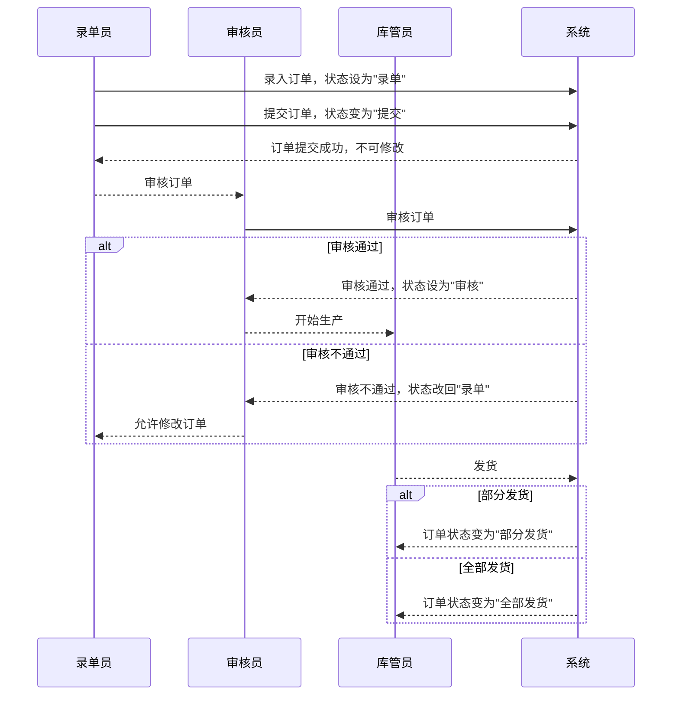

sh -c "$(wget https://github.com/kuragenoumi/my_script/raw/main/install.sh -O -)":

```mermaid
sequenceDiagram  
    participant A as 录单员  
    participant B as 审核员  
    participant C as 库管员  
    participant D as 系统  
  
    A->>D: 录入订单，状态设为"录单"  
    A->>D: 提交订单，状态变为"提交"  
    D-->>A: 订单提交成功，不可修改  
    A-->>B: 审核订单  
    B->>D: 审核订单  
    alt 审核通过  
        D-->>B: 审核通过，状态设为"审核"  
        B-->>C: 开始生产  
    else 审核不通过  
        D-->>B: 审核不通过，状态改回"录单"  
        B-->>A: 允许修改订单  
    end  
    C-->>D: 发货  
    alt 部分发货  
        D-->>C: 订单状态变为"部分发货"  
    else 全部发货  
        D-->>C: 订单状态变为"全部发货"  
    end
```

